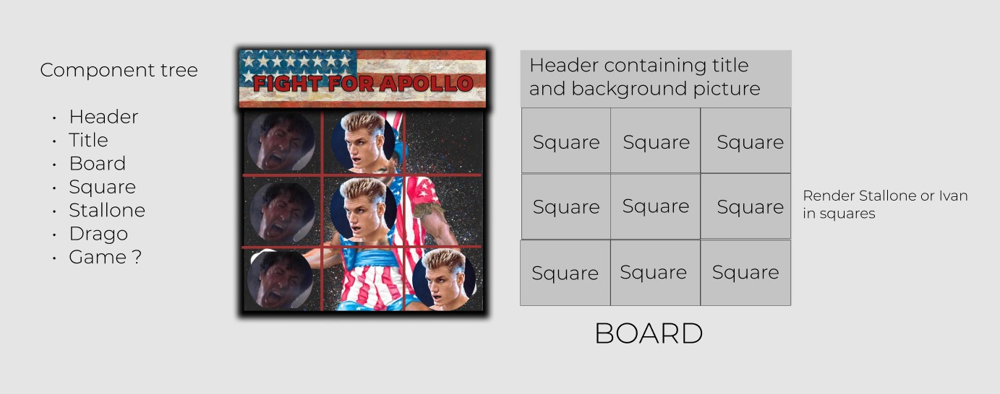

# WORK IN PROGRESS

--- 

# Fight for Apollo (Tic Tac Toe)

## Description

My personal twist of the classic Tic Tac Toe game, themed around Sylvester Stallone/Rocky IV, because we all love some 80's cheesiness.

Your best friend Apollo died on the ring at the hands of Ivan Drago. Defeat the Soviet machine to avenge him! 

## Technologies & Tools

- React
- CSS
- Figma

## Installation
- Clone the repository to your folder
- `cd` into the new folder and open your dedicated editor
- run `npm i` to install all required dependencies
- run `npm start` to spin up the app
- alternatively, just play it on [fight-for-apollo.netlify.app](https://fight-for-apollo.netlify.app/)

## Project Diary

- **20/03/2022**
  - After spending some time on this, I now have a somewhat working version. I started from the wireframing and came up with the general theme and look of the board. I used Figma to gather the material and put it together and only began writing down the code when I felt I had something concrete to start from. The basic logic of the game works, but further scouting for bugs is needed.
  Whilst working out the logic, I had the idea of having some modals to accompany certain moments of the game and add some visual candy, so I created one for game start, win, loss and draw. 
  Modals were something I hadn't implemented before, so that a nice added piece of learning.
  Logic for state management require some re-thinking, where I had initially thought I could keep everything at the child (Square) component level, but I later had to bring it up by one level (Board). At that point, all the issues sorted themselves out quite naturally.
  The logic to allow the computer to make its move after the player's was an interesting challenge, but not as complicated as I initially thought it would be. 
  - I will spend some time checking for bugs, adding a basic score system and making the app responsive. After which, potential features could be:
        - User registration and score storage in a database. This will require to set up a backend and therefore making the app full stack.
        - Adding logic by which computer actively tries to defeat the player, rather than picking random free squares.
        - different difficulty levels
        - possibility to challenge other players

## Wireframe

